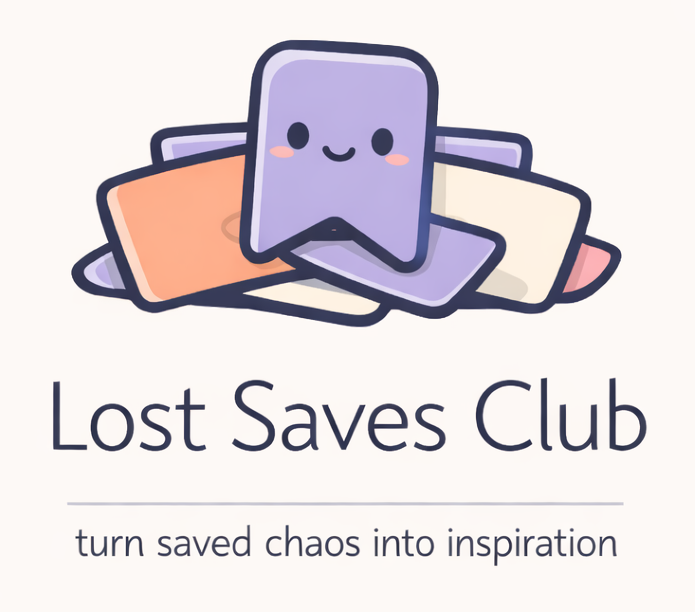

# Lost Saves Club

<p align="center">
  
</p>

## Overview
Lost Saves Club (LSC) is a small pipeline that transforms exported Instagram saved posts into a clean and searchable Obsidian vault.

It helps you:
- organize years of forgotten saved posts;
- automatically categorize inspirations using hashtags;
- generate Markdown notes compatible with Obsidian;
- archive creative references, recipes, knitting ideas, art, design, and more.

## Prerequisites
1. Download your Instagram data export and place the saved posts JSON file inside: `input_data/`.

2. Install dependencies: `pip install -r requirements.txt`.

3. Install Playwright browser: `playwright install`.

## Usage
Run the importer and organizer: `python organize`.

The script will:
- Parse Instagram saved posts
- Detect categories from hashtags
- Generate Markdown notes
- Create an Obsidian-ready folder structure

## Configuration
### Categories
Categories are configured inside: `config/config.yml`.

Example:
```yaml
category_map: {
  "knit": ["knit", "tricot", "laine"]
}
```
Posts containing matching hashtags will automatically be sorted into the corresponding category folder.

### Markdown Template
Markdown notes are generated from: `templates/markdown_template.txt`.

Available variables are: url, date, caption, hashtags, author, custom category, image.

## Licence
MIT Licence